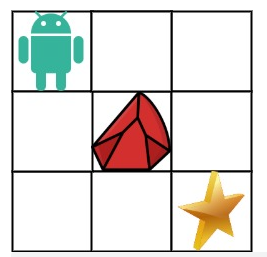

### 63.不同路径II

一个机器人位于一个 `m x n` 网格的左上角 （起始点在下图中标记为 “Start” ）。

机器人每次只能向下或者向右移动一步。机器人试图达到网格的右下角（在下图中标记为 “Finish”）。

现在考虑网格中有障碍物。那么从左上角到右下角将会有多少条不同的路径？

网格中的障碍物和空位置分别用 1 和 0 来表示。

来源：力扣（LeetCode）
链接：https://leetcode.cn/problems/unique-paths-ii

思路：

​	（1）与62题类似，`dp`以及下标`i`的定义完全一致，将`dp`数组元素全部初始化为0；

​	（2）递推公式：

				if(obstacleGrid[i][j]==0){
					dp[i][j] = dp[i-1][j]+dp[i][j-1];
	      }else{
	      	dp[i][j] = 0;
	      }

​	(3) 初始化：首先判断`obstacleGrid[0][0]`和`obstacleGrid[obstacleGridSize-1][*obstacleGridColSize-1]`如果两者有一个为1，那么就直接返回0即可。在62题的基础上，初始化`i=0`元素以及`j=0`元素时，需要同时判断`obstacleGrid`矩阵中该元素是否为0，为0时直接给`dp[i][j]`赋值为1，如果遇到`obstacleGrid[i][0]=1`或者`obstacleGrid[0][j]=1`时，就停止，从这个点开始往后所有`j=0`和`j=0`的元素都为0：

	for(int i=0; i<obstacleGridSize&&obstacleGrid[i][0]==0; i++){
	    dp[i][0] = 1;
	}
	for(int j=0; j<*obstacleGridColSize&&obstacleGrid[0][j]==0; j++){
	    dp[0][j] = 1;
	}

​	（4）遍历顺序：从前往后。`i`和`j`的取值都从1开始，遍历到维度数为止：

		if(obstacleGrid[i][j]==0){
			dp[i][j] = dp[i-1][j]+dp[i][j-1];
	  }else{
	  	dp[i][j] = 0;
	  }

​		最终返回值为`dp[obstacleGridSize-1][*obstacleGridColSize-1]`。